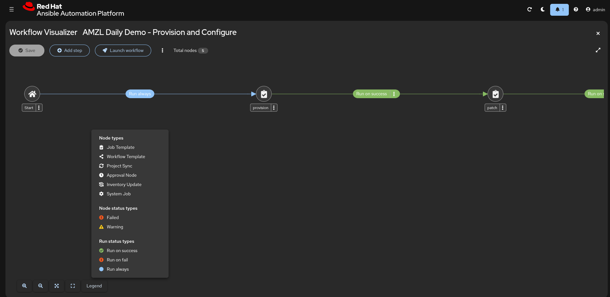
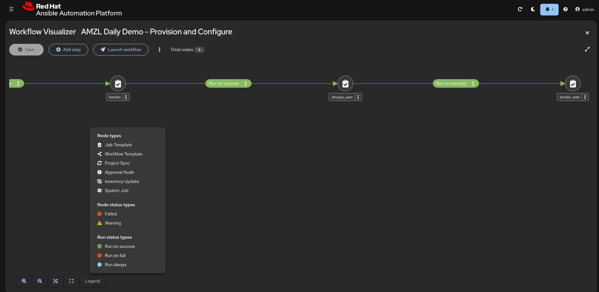
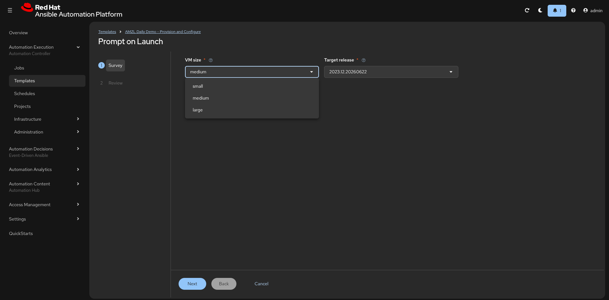

# AMZL-dailydemo — Build Narrative

_A phased narrative of how the demo was built. For the timestamped,
commit-by-commit log (times, model, hashes), see
[`amzl-build-session-report.md`](amzl-build-session-report.md)._

## Cloud Use Cases

The customer's use case — the four cloud operations this demo automates end to
end:

- **Patch our AMZL2023 VMs to a certain release**
- **Create users** — add to the sudoers group, set the password, and add an SSH
  public key
- **Initial system configuration** — security best practices, chrony and other
  utils, admin user setup, initial patching
- **Deploy a Docker app** — ensure the user belongs to the docker group; pull and
  deploy a Docker image

A single **5-node workflow** (`AMZL Daily Demo - Provision and Configure`)
satisfies all four — provision → patch → harden → create user → deploy Docker:

### Discovery

Questions to explore with the customer, to anchor the demo to their reality:

- **Why this use case?** What triggered it — a new cloud footprint, an
  audit/compliance driver, a migration off hand-built VMs, developer-onboarding
  pain?
- **What does it look like today?** How are AMZL2023 VMs currently provisioned,
  patched, hardened, and handed to developers — what's manual, what's scripted,
  who owns each step, and where does it break down?

> **Why AAP over AWX?** Most of what follows — config-as-code, execution
> environments, workflows, surveys, schedules — is a *discipline* (UI-clicking vs
> GitOps) that AWX supports too, since AAP's automation controller is built from
> AWX. The genuine reasons to reach for AAP are the enterprise layer around it:
> **Red Hat support/SLA, certified content + Automation Hub, Automation Analytics,
> the platform gateway (SSO + unified UI), and enterprise RBAC/lifecycle.** The
> notes below therefore contrast *click-ops vs config-as-code*, and call out AAP
> specifically only where it's genuinely the differentiator.

## Phase 1 — Foundation — stand up every layer

> 🎯 **Outcome —** a reproducible environment anyone can stand up from scratch.

1. Scaffold repo — community standards + governance
   - Click-ops keeps your config in the platform database; config-as-code makes the Git repo the system of record
   - Without structure (CODEOWNERS, linting, PR templates) there's no review gate or audit trail on changes
   - The mindset shift: if it's not in the repo, it doesn't exist reproducibly

2. Add Execution Environment definition
   - Replaces the old Tower/venv model ("ssh into the control node and pip install") — historically the #1 source of dependency drift
   - EEs are container images: pinned dependencies, portable across dev/stage/prod
   - Skip a defined EE and you fight dependency mismatches on every upgrade

3. Add Terraform stack for Amazon Linux 2023

4. Add workflow playbooks and roles (nodes 1–5)
   - Workflows chain job templates — each node is a discrete, testable, reusable unit
   - Decomposing into nodes beats one monolithic playbook: smaller blast radius, reusable pieces, cleaner failure isolation

5. Add AAP config-as-code (5 job templates + 5-node workflow)
   - Every controller object — credentials, projects, templates, workflows — defined in YAML, not clicked in the UI
   - Promotion across environments becomes a Git merge instead of manually recreating objects (see **Reference** below for a full dev/qa/prod pipeline)
   - Configure by hand in the UI and you lose reproducibility and the audit trail

6. Add dev-environment template and demo talk track
7. Fix EE build: require `PYCMD=/usr/bin/python3.11` 🔴 **[fix]**
8. Roadmap: EE built + pushed public; mark load as NEXT

## Phase 2 — Config-as-code & platform baseline

> 🎯 **Outcome —** platform settings and surveys are reviewable and consistent across environments.

9. Baseline settings as code: pre-login banner + Automation Analytics
   - Even platform-level settings are code — the pre-login banner and Automation Analytics opt-in load from the repo, not the UI
   - Automation Analytics is a genuine AAP capability (subscription-tied, not in AWX) — and here it's enabled as code like everything else

10. Provision node: guard that ensures the Terraform state bucket exists

11. Survey: make Target release a dropdown of recent AL2023 releases
    - Surveys defined in the CaC YAML are versioned, reviewable, and consistent across environments
    - Edit a survey in the UI and the change lands with no review and no audit trail

## Phase 3 — Debug to green — the real engineering

> 🎯 **Outcome —** the AL2023-specific failures are solved once, in code, not re-hit each demo.

12. Fix role resolution (move roles under `playbooks/`) + drop on-launch sync 🔴 **[fix]**
    - Ansible resolves roles from `<playbook_dir>/roles`, so roles must sit adjacent to the playbooks that use them
    - With no project-local `ansible.cfg` to add a rolepath, layout is the contract — misplace a role and it fails to resolve at runtime

13. Project CaC: explicitly disable `scm_update_on_launch`
    - Per-project SCM settings give fine-grained control over when the platform pulls from Git
    - Disabling update-on-launch prevents an unexpected mid-demo sync from changing what runs

14. Fix devops user: hash password on target, not in the EE 🔴 **[fix]**
    - EEs are immutable containers — anything that depends on target state (like hashing a password) must run on the target, not in the EE
    - Easy trap when you're used to the control node doing the work

15. Roadmap: mark Phase 5 in progress; log decisions
16. Add `tools/` operator helpers: project sync and job fetch

17. Fix Docker SDK install: virtualenv to avoid RPM conflict on AL2023 🔴 **[fix]**
    - The EE isolates the control-side Python deps — but the target node still needs the Docker SDK to manage containers
    - Installing it into a virtualenv on the target avoids clobbering AL2023's RPM-managed Python (the classic pip-vs-dnf conflict)

## Phase 4 — Operations, polish & docs to tested state

> 🎯 **Outcome —** a demo-ready, cost-controlled (nightly teardown) system with onboarding docs.

18. Enhance webserver page: Ansible logo, release version, URL in job log
19. Add nightly teardown: job template + 6 PM Arizona schedule
    - Schedules are config-as-code too — repeatable and version-controlled, not one-off cron set in the UI
    - Loading them from the repo means every environment gets the same teardown, with no per-env clicking

20. Replace inline SVG with AAP logo PNG from brand assets

21. Add control inventory for localhost-only job templates
    - A localhost-only template still needs an inventory assigned, even though the platform provides an implicit localhost
    - Giving provision/teardown their own empty control inventory avoids "resource is being used by running jobs" errors when teardown deletes hosts from the main inventory

22. Fix teardown: guard host deregistration against empty Terraform state 🔴 **[fix]**
23. Pin AMI to AL2023 2023.12.20260608 so patching demo can move forward

24. Add new-user AAP load guide; correct README/ROADMAP to tested state
    - Onboarding docs in the repo mean any team member can stand up the full environment from scratch
    - Runbooks in Git beat tribal knowledge — the repo, not someone's memory, is the source of truth

25. Fix broken in-page anchor links in loading-aap guide 🔴 **[fix]**
26. Update demo talk track to tested state

## Demo — the running result

The workflow completing successfully, and the app it deploys:

---

**Reference —** [`ericcames/aap_config`](https://github.com/ericcames/aap_config):
a standalone config-as-code starter kit that takes this same pattern further —
export from managed AAP and promote across dev/qa/prod via GitHub Actions.
(Distinct from this repo's local `aap_config/` directory; the promotion pattern
is cloud-agnostic.)
